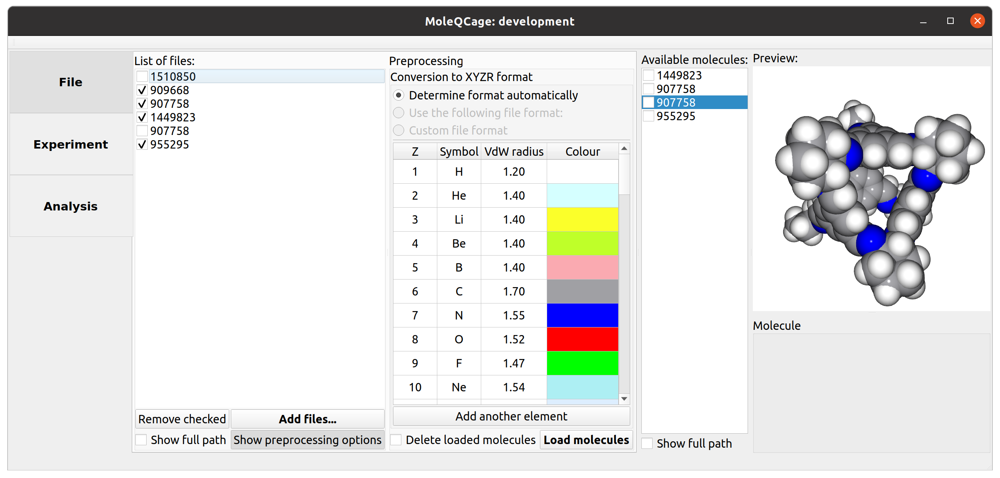
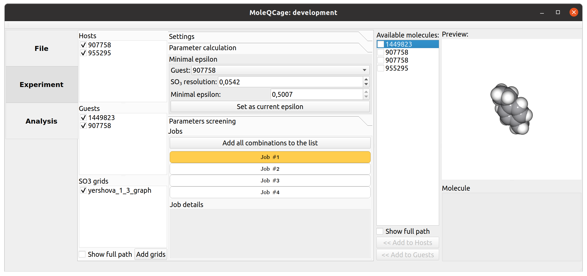
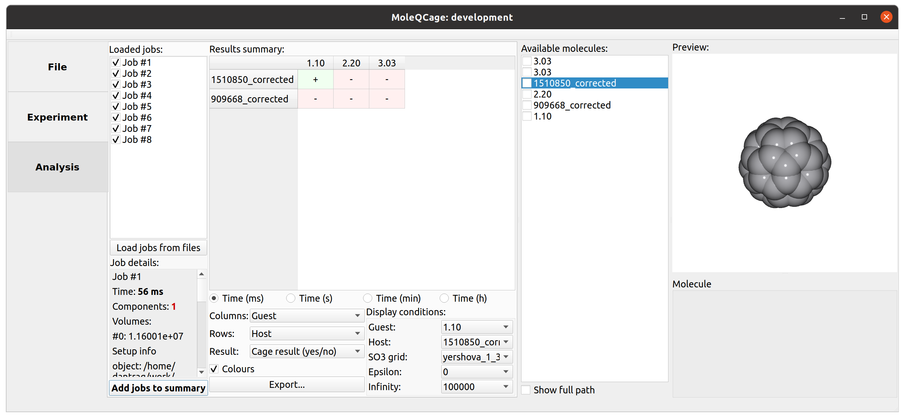

## MoleQCage: Qt-based UI framework for molecular caging screening

Official implementation of the molecular caging screening algorithm ([A Robotics-Inspired Screening Algorithm for Molecular Caging Prediction](https://pubs.acs.org/doi/10.1021/acs.jcim.9b00945))
_Currently under development._

**TL;DR** The software implements a [3D robotics caging algorithm](https://journals.sagepub.com/doi/full/10.1177/0278364920932996) for molecular structures and provides a UI tool for screening several host and guest molecules. See [original paper](https://pubs.acs.org/doi/10.1021/acs.jcim.9b00945) for more details. The package is formulated as a source for the [MoleQCage Docker container](https://hub.docker.com/repository/docker/dantrigne/moleqcage).

### Instructions (to be detailed)

#### Select the input molecule files

#### Choose the hosts and guests for screening, select precision and submit the experiments

#### Analyze the outcome

